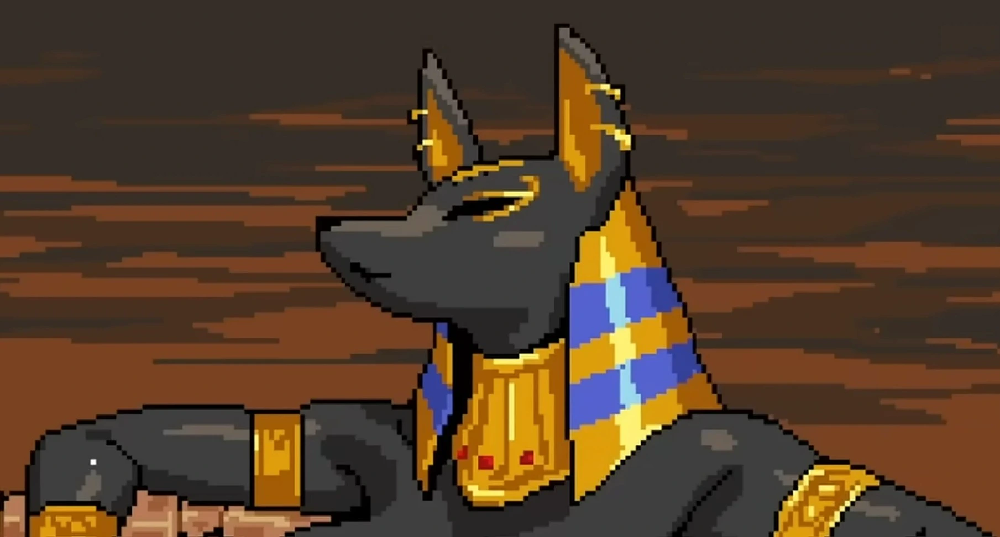
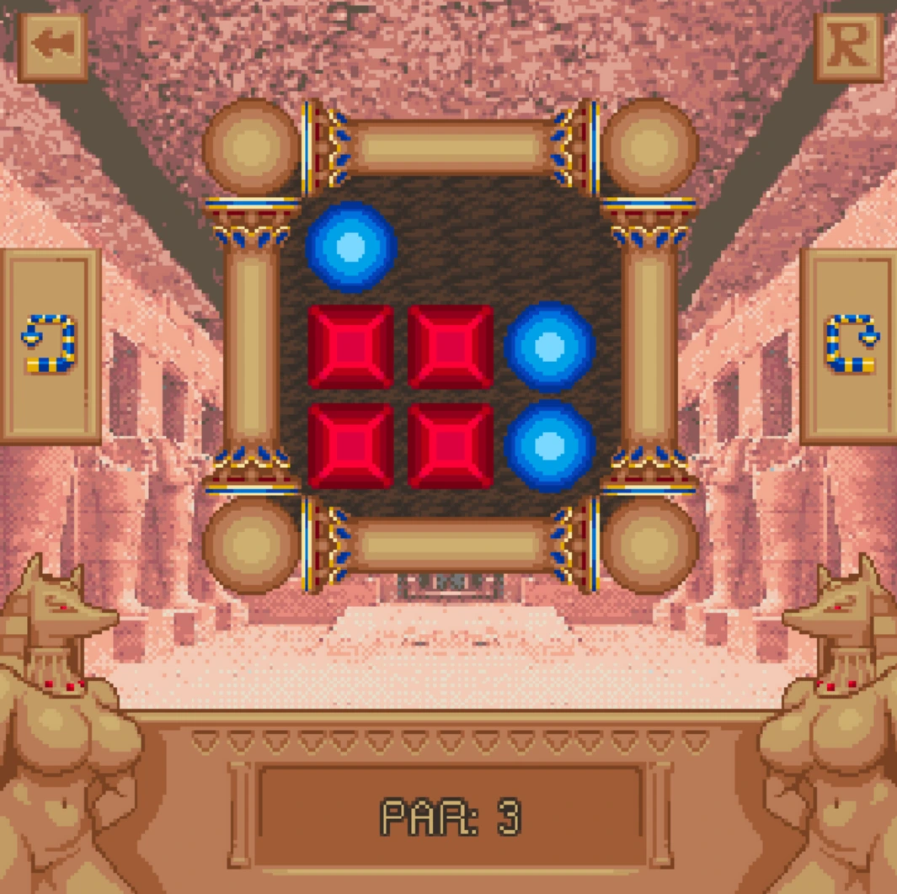
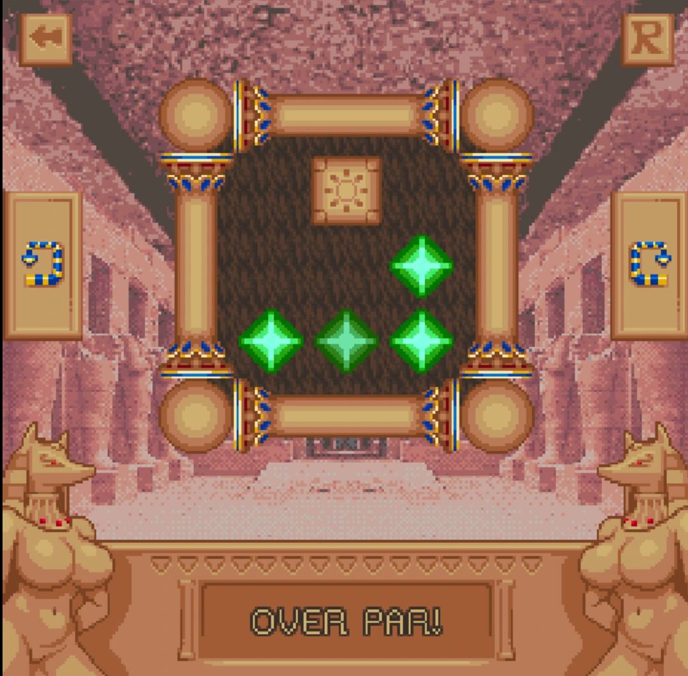
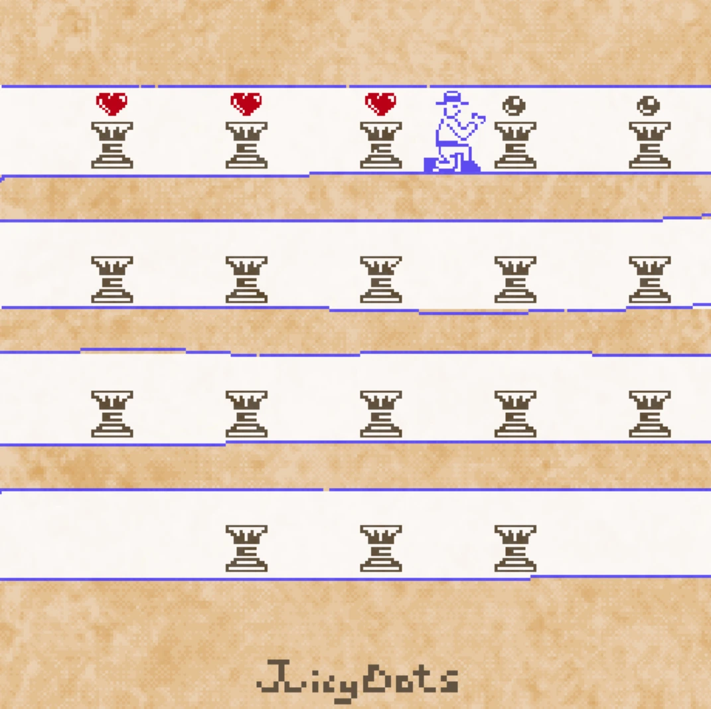

# Temple of the Jackal — Browser Edition

[](https://templeofthejackal.com/)

**Temple of the Jackal** is a restored browser edition of a compact Godot 3 puzzle game set inside a stylized Egyptian excavation. The complete website is available at **[templeofthejackal.com](https://templeofthejackal.com/)**. It places the playable WebAssembly build inside a responsive game portal, adds accurate instructions and troubleshooting help, and surrounds the original pixel-art experience with a distinct sandstone, charcoal, rust, and gold visual identity.

> **Adults only:** the game is intended for players aged 18 or older. Puzzle progression can unlock two mature story scenes containing explicit sexual content and nudity. The public-facing website avoids explicit screenshots, but visitors should read the age notice before launching the game.



## Play online

The fastest way to enter the temple is to visit **[https://templeofthejackal.com/](https://templeofthejackal.com/)**. No separate installer, account, or download is required. The player loads the restored Godot export from the same domain, so the game can run inside the main page without depending on an external game host. A deliberate launch screen confirms that the visitor is at least 18 years old before the iframe starts.

The original game uses a square 256 × 256 pixel canvas. The website enlarges that canvas while preserving crisp pixel rendering. Desktop browsers provide the most comfortable experience, although the surrounding interface is responsive and can be used on tablets and larger phones. Fullscreen and sharing controls are built into the player toolbar.

## How the puzzle works

Each of the eighteen chambers contains colored orbs, platforms, and two direction controls. Pressing the control on the left or right rotates the entire chamber by ninety degrees. Gravity then pulls every movable orb in the new downward direction. When orbs of the same color touch, they disappear. A chamber is complete when every orb has been removed.

The mechanic is easy to understand but rewards planning. A rotation that immediately matches one pair can separate another pair behind a platform, so efficient solutions require looking at the complete board before committing to a direction. The game also displays a par target. Rooms may still be completed after exceeding par, while the target encourages players to revisit a puzzle and find a cleaner sequence.







## Website features

The portal is more than a bare iframe. It includes a centered game frame, age confirmation, share modal, fullscreen control, gameplay feature tags, embedded YouTube videos, real screenshots, a four-step visual guide, long-form editorial information, browser troubleshooting, mature-content notices, and a detailed FAQ. The sticky header keeps important navigation available throughout the long page, while the highlighted **Play More** link jumps directly to the shared game archive.

An optional **Chamber Progress** tracker lets players manually mark any of the eighteen rooms they have cleared. The tracker shows a horizontal completion bar and stores the selected chamber numbers only in the current browser. It does not create an account or send checklist data to a server. Players can reset the tracker at any time.

The project also includes the trust pages expected from a complete public website: About Us, Privacy Policy, Contact, and Terms of Service. These pages are linked in the shared footer and included in the sitemap. Support, correction, privacy, and rights-related questions can be sent to **mooyuking@gmail.com**.

## Technology

The website uses Next.js 16, React 19, TypeScript, and Tailwind CSS 4. Next.js is configured with `output: "export"`, producing a static `out/` directory suitable for GitHub Pages, Cloudflare Pages, Netlify, traditional object storage, or any web server capable of serving static files. Images are exported without a runtime image-optimization service, and trailing slashes are enabled for predictable static hosting.

The playable game is a Godot 3 web export consisting of an HTML loader, JavaScript glue code, a WebAssembly engine, a PCK data package, and supporting audio-worklet files. It is served from `public/games/temple-of-the-jackal/` and appears in the final static export under the same path.

SEO support includes descriptive metadata, a canonical domain, Open Graph and Twitter information, `VideoGame` and `FAQPage` structured data, `robots.txt`, and `sitemap.xml`. The page uses one primary heading, descriptive alternative text for meaningful images, crawlable editorial copy, and direct internal links to every required information page.

## Local development

Install dependencies and start the development server:

```bash
npm install
npm run dev
```

Then open the local URL shown by Next.js. Run the standard quality checks before publishing:

```bash
npm run lint
npm run build
```

The normal build creates a fresh static export in `out/`. For the deployment repository, use the preservation command instead:

```bash
npm run build-preserve-git
```

## Safe static-export workflow

The `out/` directory is designed to be its own Git repository. The first preservation build creates `out/README.md` from this document and initializes `out/.git` when those entries do not exist. It configures the expected deployment remote as `https://github.com/mooyu-king/Temple-of-the-Jackal.git` without pushing or committing anything.

On every later run, `scripts/build-preserve-git.js` temporarily saves `out/.git` and `out/README.md`, removes the old generated export, runs a clean Next.js build, and restores both preserved entries unchanged. This means the deployment repository history, remote configuration, branch metadata, and hand-maintained README survive full rebuilds. Do not use a manual deletion command that removes the entire `out/` directory without first protecting those two entries.

After a successful preservation build, review the generated files and publish from inside `out/` using your normal Git workflow. The script deliberately does not stage, commit, or push changes. Deployment remains an explicit action controlled by the repository owner.

## Main project structure

```text
src/app/                         Next.js routes, metadata, sitemap, and policies
src/components/GamePortal.tsx    Main game portal and interactive controls
public/                          Logo, screenshots, cover art, and browser game
game-project/                    Recovered Godot project used for the web export
scripts/build-preserve-git.js    Safe deployment-export builder
out/                             Generated static site and deployment Git repository
```

## Privacy and content notes

The website does not require a user account. The manual progress checklist and compatible game-save information use browser-managed storage. Embedded YouTube players may process technical information according to Google and YouTube policies. Hosting providers may also process routine request information such as IP addresses, timestamps, browser types, and error logs. Full details are available in the published Privacy Policy.

This is an unofficial browser portal rather than the original developer or publisher website. Game names, characters, artwork, code, and related assets remain the property of their respective owners. The surrounding website design, guide, troubleshooting information, and editorial text were created for this restored browser presentation.

## Visit the temple

Ready to rotate the chamber and match the colors? **[Play Temple of the Jackal online at templeofthejackal.com](https://templeofthejackal.com/)**.
